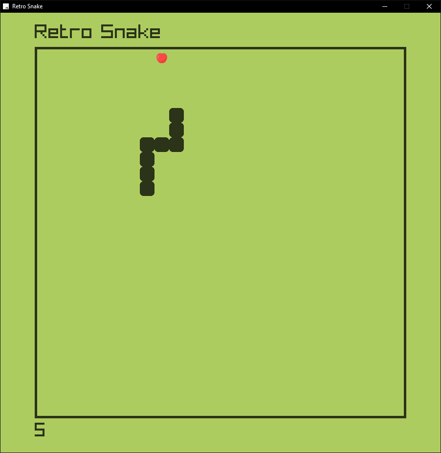

# Retro Snake
A classic Snake game built using C++ and Raylib. This project serves as a fun exercise to practice game development with C++ and the Raylib library. The game features a traditional Snake experience with some enhancements and possible future improvements.

## Features
- **Snake Movement**: Controlled by arrow keys or WASD.
- **Food Collection**: Eat food to grow the snake and increase the score.
- **Walls and Collisions**: Collide with walls or the snake's own tail to trigger game over.
- **Scoring System**: Track your score based on the number of food items consumed.
- **Sound Effects**: Includes sound effects when eating food and colliding with walls.
- **Pause/Resume**: Toggle between pausing and resuming the game with the **P** and **Space** keys.
- **Game Over Screen**: Restart the game when a collision occurs.

## Installation

1. **Clone the repository:**
    ```bash
    git clone https://github.com/Jastreas/C++_RayLib_SnakeClone.git
    cd C++_RayLib_SnakeClone
    ```

2. **Install dependencies:**  
    Make sure you have a C++ compiler (like G++) and the Raylib library installed. For installation, follow the instructions on the [Raylib website](https://www.raylib.com).

    On **Linux**, you can install Raylib with the following:
    ```bash
    sudo apt-get install libraylib-dev
    ```

    On **Windows**, follow the [Raylib installation guide](https://www.raylib.com).

3. **Open the project with VSCode:**  
    Make sure you have C++ development extensions, after opening the project hit f5 and let the makefile do its job, once ingame just press **Space** to begin the game!

## How to Play
- **Move Snake**: Use the W, A, S, D keys or the Arrow keys to control the snake's direction.
- **Pause/Resume**: Press **P** or **Space** to pause or resume the game.
- **Objective**: Eat as much food as possible without running into the walls or your own tail to maximize your score.
- **Game Over**: When you hit a wall or collide with your tail, the game will reset.

## Future Updates
Planned features for future versions:
- Different types of food with buffs or debuffs for the player.
- A 3-life system that gives the player 3 chances before the game ends.
- Various difficulty levels with increasing snake speed.
- A congratulatory or pressure message after achieving a specific score.
- Modular code structure with separate files for different game components.

## Contributing
Feel free to fork this repository, make changes, and submit pull requests! Contributions to improve gameplay, features, or code structure are always welcome.

## License
This project is open-source and available under the [MIT License](LICENSE).


